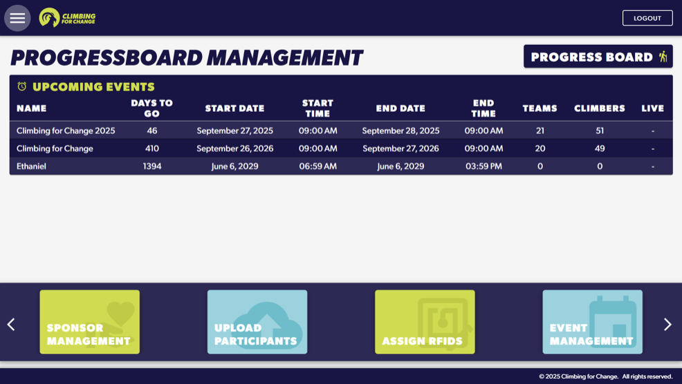

# ClimbingForChange
## 📸 Application Preview


## Overview

ClimbingForChange is a full-stack web application designed to manage and track event-based activities, including participants, teams, and progress tracking.

The system includes an **admin dashboard** for data management and a **progress board** for real-time visualization of event performance.

---

## Key Features

* Admin dashboard for managing events, teams, and participants
* Real-time progress tracking and leaderboard display
* RFID-based participant tracking system (simulated)
* Interactive UI for monitoring event performance
* Data-driven insights through tables and progress views

---

## Tech Stack

### Frontend

* React (Vite)
* JavaScript
* CSS

### Backend

* Node.js
* Express

### Database

* SQL

---

## Architecture

The application follows a full-stack architecture:

* Frontend (React): Handles UI and user interactions
* Backend (Node.js / Express): Manages API logic and data processing
* Database (SQL): Stores event, team, and participant data

All components communicate through REST APIs.

---

## Getting Started

### Prerequisites

* Node.js
* npm

---

### Installation

```bash
git clone https://github.com/khalif-fatimaa/ClimbingForChange.git
cd ClimbingForChange
```

Install dependencies:

```bash
cd client
npm install

cd ../server
npm install
```

---

### Running the Application

Start the backend:

```bash
cd server
npm start
```

Start the frontend:

```bash
cd client
npm run dev
```

Open in browser:

```
http://localhost:5173
```

---

## Project Structure

```
client/   → Frontend (React)
server/   → Backend (Node.js / Express)
```

---

## Highlights

* Built a scalable full-stack system with structured API design
* Developed reusable components for admin dashboards and tables
* Implemented real-time progress tracking features
* Designed clean and modular architecture for maintainability

---

## Authors

Fatima Khalif
Ayan Salat
Junior Software Developers
